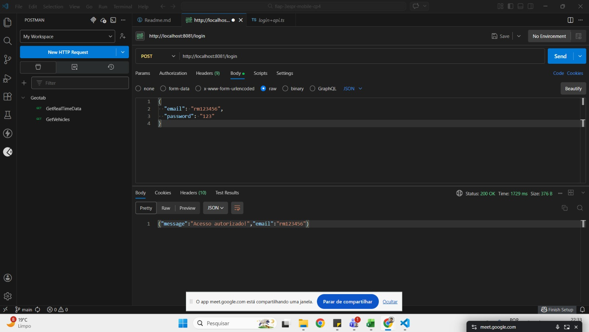
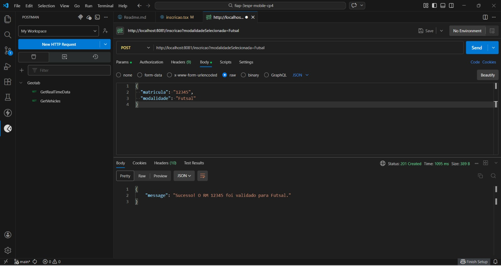
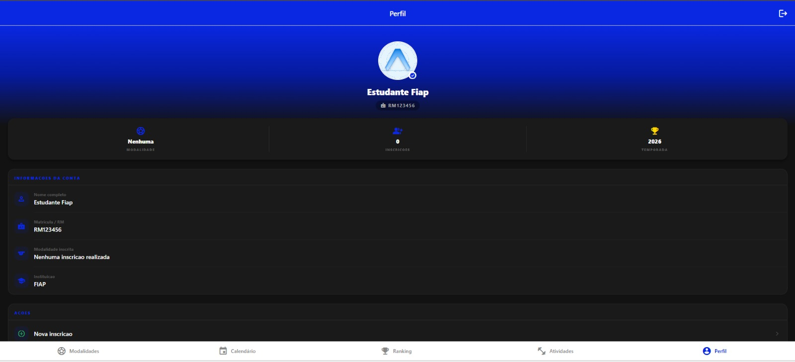

# Interclasse Digital - FIAP

Aplicativo mobile desenvolvido em React Native para gerenciamento de torneios esportivos escolares. O projeto permite que alunos façam login, visualizem as modalidades disponíveis, acompanhem a tabela de classificação, consultem o calendário de jogos, realizem inscrições em equipes e acessem o perfil do usuário.

Projeto desenvolvido para o Checkpoint de Desenvolvimento Mobile — 2º Semestre, FIAP.

---

## Integrantes

| Nome | RM |
|------|----|
| Gabriel Mediotti Marques | RM 552632 |
| Jó Sales | RM 552679 |
| Miguel Garcez de Carvalho | RM 553768 |
| Vinicius Souza e Silva | RM 552781 |
| Gustavo Bezerra Assumção | RM 553076 |

---

## Tecnologias utilizadas

- **React Native** com **Expo** (SDK 55)
- **Expo Router** — navegação baseada em arquivos, com suporte a API Routes
- **TypeScript**
- **Axios** — integração com as APIs REST
- **AsyncStorage** — persistência de dados local no dispositivo
- **expo-linear-gradient** — gradientes nas telas
- **@expo/vector-icons (MaterialIcons)** — ícones

---

## Estrutura do projeto

```
fiap-3espr-mobile-cp4/
├── src/
│   ├── app/
│   │   ├── _layout.tsx             # Layout raiz com tabs de navegação e botão de logout
│   │   ├── index.tsx               # Tela de login
│   │   ├── modalidades.tsx         # Tela com as modalidades esportivas
│   │   ├── inscricao.tsx           # Tela de inscrição de equipe
│   │   ├── calendario.tsx          # Tela do calendário de jogos (com cache offline)
│   │   ├── classificacao.tsx       # Tela da tabela de classificação
│   │   ├── educacao-fisica.tsx     # Tela de atividades e participantes
│   │   ├── perfil.tsx              # Tela de perfil do usuário logado
│   │   ├── login+api.ts            # Endpoint POST /login
│   │   ├── inscricao+api.ts        # Endpoint POST /inscricao
│   │   ├── calendario+api.ts       # Endpoint GET /calendario
│   │   └── classificacao+api.ts    # Endpoint GET /classificacao
│   └── server/
│       └── api.ts                  # Instância configurada do Axios
├── assets/                         # Imagens e recursos estáticos
└── package.json
```

---

## Fluxo do sistema

```
Usuário abre o app
        |
        v
[Login] -- verifica AsyncStorage (@interclasse_user)
        |                               |
   sessao ativa                  sem sessao
        |                               |
        v                               v
[Modalidades]              preenche email/RM + senha
        |                               |
        |                       valida formulario
        |                               |
        |                       redireciona para
        v                        [Modalidades]
[Tabs de navegacao]
  |         |         |           |          |
  v         v         v           v          v
[Modal.]  [Calend.]  [Classif.]  [Ativ.]  [Perfil]
  |           |
  v           v
[Inscricao] GET /calendario
POST /inscricao  salva no AsyncStorage
salva no AsyncStorage
```

Ao fazer logout (pelo perfil ou pelo botao no header), o AsyncStorage e limpo e o usuario retorna para a tela de login.

---

## Componentes utilizados

| Componente | Uso |
|-----------|-----|
| `Text` | Todos os textos e títulos |
| `TextInput` | Campos de login e inscrição |
| `Pressable` | Botões com feedback de toque |
| `FlatList` | Listas de jogos, classificação e participantes |
| `Image` | Avatar/foto na tela de perfil |
| `ActivityIndicator` | Loading durante chamadas de API |
| `ScrollView` | Rolagem em telas com muito conteúdo |
| `KeyboardAvoidingView` | Ajuste do layout ao abrir teclado |
| `StyleSheet` | Estilização de todos os componentes |
| `MaterialIcons` | Ícones de navegação e UI |
| `LinearGradient` | Gradientes nos cards e no header |

---

## Persistência com AsyncStorage

| Chave | Conteúdo | Onde é usado |
|-------|----------|--------------|
| `@interclasse_user` | RM ou e-mail do usuário logado | Login, Layout (logout) |
| `@interclasse_perfil` | Objeto com rm, nome e modalidade | Login, Classificação, Ed. Física, Perfil |
| `@interclasse_jogos` | Array de jogos em cache | Calendário (acesso offline) |
| `@interclasse_lista_inscricoes` | Array de inscrições realizadas | Inscrição, Classificação |

O calendário busca os dados da API na primeira abertura e salva localmente. Nas aberturas seguintes, os dados são carregados do AsyncStorage mesmo sem internet. O usuário pode forçar atualização com pull-to-refresh.

---

## Telas do aplicativo

| Tela | Arquivo | Tab no menu |
|------|---------|-------------|
| Login | `src/app/index.tsx` | Oculta (tela inicial) |
| Modalidades | `src/app/modalidades.tsx` | Modalidades |
| Calendario | `src/app/calendario.tsx` | Calendario |
| Ranking | `src/app/classificacao.tsx` | Ranking |
| Atividades | `src/app/educacao-fisica.tsx` | Atividades |
| Perfil | `src/app/perfil.tsx` | Perfil |
| Inscricao | `src/app/inscricao.tsx` | Oculta (tela interna) |

---

## API — Rotas disponíveis

As rotas são servidas pelo próprio servidor do Expo Router na porta `8081`. Elas ficam disponíveis enquanto o comando `npx expo start` estiver rodando.

---

### GET /calendario

Retorna a lista de jogos agendados.

**Request:**
```
GET http://localhost:8081/calendario
```

**Response 200:**
```json
[
  {
    "id": "1",
    "modalidade": "Futsal",
    "equipas": "3º ES vs 2º ADS",
    "data": "20/11 - 10:00",
    "local": "Quadra Principal"
  },
  {
    "id": "2",
    "modalidade": "Vôlei",
    "equipas": "1º ES vs 4º SI",
    "data": "20/11 - 11:30",
    "local": "Ginásio 2"
  }
]
```

---

### GET /classificacao

Retorna a tabela de classificação geral.

**Request:**
```
GET http://localhost:8081/classificacao
```

**Response 200:**
```json
[
  { "id": "rm_api_1", "nome": "3º ES Paulista", "pontos": 50 },
  { "id": "rm_api_2", "nome": "2º ES Lins", "pontos": 40 }
]
```

---

### POST /login

Autentica o usuário pelo RM ou e-mail e senha.

**Request:**
```
POST http://localhost:8081/login
Content-Type: application/json

{
  "email": "rm123456",
  "password": "123"
}
```

**Response 200 — sucesso:**
```json
{
  "message": "Acesso autorizado!",
  "email": "rm123456"
}
```

**Response 401 — credenciais inválidas:**
```json
{
  "message": "Credenciais inválidas. Tente RM: rm123456 e Senha: 123"
}
```

**Response 500 — erro interno:**
```json
{
  "message": "Erro interno no servidor."
}
```

**Regras de validação:**
- O campo `email` aceita RM no formato `rm123456` ou qualquer string com `@`
- O campo `password` deve ser `123`
- O servidor normaliza o login (trim + lowercase) antes de validar

---

### POST /inscricao

Registra uma equipe em uma modalidade.

**Request:**
```
POST http://localhost:8081/inscricao
Content-Type: application/json

{
  "matricula": "RM123456",
  "modalidade": "Futsal",
  "integrantes": ["Aluno 1", "Aluno 2", "Aluno 3"]
}
```

**Response 201 — sucesso:**
```json
{
  "message": "Sucesso! O RM RM123456 foi validado para Futsal."
}
```

**Response 400 — dados faltando:**
```json
{
  "message": "A Matrícula e a Modalidade são obrigatórias para a inscrição."
}
```

**Response 500 — erro interno:**
```json
{
  "message": "Erro interno do servidor ao processar a inscrição."
}
```

**Regras de validação:**
- Os campos `matricula` e `modalidade` são obrigatórios
- O campo `integrantes` é opcional mas recomendado

---

## Como rodar o projeto

### Pré-requisitos

- Node.js 18 ou superior
- npm ou yarn
- Expo CLI instalado globalmente (`npm install -g expo-cli`)
- App Expo Go instalado no celular (para testar no dispositivo físico)

### Instalação

```bash
# Clone o repositório
git clone <url-do-repositorio>
cd fiap-3espr-mobile-cp4

# Instale as dependências
npm install

# Inicie o servidor de desenvolvimento
npx expo start
```

### Ambientes de teste

Após rodar `npx expo start`, escolha o ambiente:

| Ambiente | Como acessar |
|----------|-------------|
| Celular físico | Abra o Expo Go e escaneie o QR Code exibido no terminal |
| Emulador Android | Pressione `a` no terminal |
| Simulador iOS | Pressione `i` no terminal (requer macOS) |
| Navegador web | Pressione `w` no terminal |

### Configuração do Axios por ambiente

Edite o arquivo [src/server/api.ts](src/server/api.ts) e descomente a linha correspondente ao seu ambiente:

```ts
// Web ou Simulador iOS:
const IP_REDE_LOCAL = "http://localhost:8081";

// Emulador Android Studio:
// const IP_REDE_LOCAL = "http://10.0.2.2:8081";

// Celular físico (substitua pelo IP da sua máquina):
// const IP_REDE_LOCAL = "http://192.168.1.XX:8081";
```

### Credenciais de teste

```
Login: RM123456
Senha: 123
```

---

## Como testar as APIs (Postman / Insomnia / Thunder Client)

As rotas ficam disponíveis na porta `8081` enquanto o `npx expo start` estiver ativo.

1. Inicie o projeto com `npx expo start`
2. Abra o Postman (ou outro cliente HTTP)
3. Use as URLs e payloads descritos na seção de rotas acima
4. Todas as rotas retornam JSON

---

## Evidencias de teste

### Testes de API

#### POST /login — Status 200 OK



#### POST /inscricao — Status 201 Created



### Telas do aplicativo

#### Tela de Perfil



*(Adicione prints das demais telas aqui)*

### Video de demonstracao

*(Adicione o link do video aqui)*
